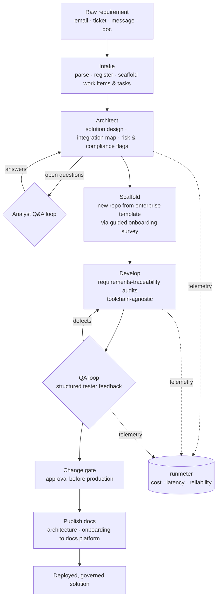

# Agentic Delivery Pipeline

[](https://github.com/Aptica-Solutions/a-agentic-delivery-pipeline/actions/workflows/ci.yml)
[](LICENSE)


An AI-native, skills-driven delivery pipeline that carries a raw requirement all the way to a governed, documented, deployed solution, with a human in the loop at every gate that matters.

This repo documents the **pattern**, genericized, and ships a small **runnable reference implementation** (`pipeline/`) that demonstrates it end to end. It is the reference design behind a production implementation built as a set of composable Claude/Cowork skills. Each stage is a small, single-purpose agent that hands a structured artifact to the next, so the whole lifecycle, from intake to production sign-off, runs as one continuous, resumable flow instead of a pile of disconnected tools.

Companion project: [runmeter](https://github.com/Aptica-Solutions/a-mcp-runmeter) provides the cost and reliability telemetry layer these stages emit to.

## The flow



Static exports for slides, resume, or LinkedIn (source: [docs/pipeline.mmd](docs/pipeline.mmd)):

| Layout | Light | Dark / transparent |
|--------|-------|--------------------|
| Vertical | [pipeline.png](docs/pipeline.png) / [.svg](docs/pipeline.svg) | [pipeline-dark.png](docs/pipeline-dark.png) / [.svg](docs/pipeline-dark.svg) |
| Wide (16:9) | [pipeline-wide.png](docs/pipeline-wide.png) / [.svg](docs/pipeline-wide.svg) | [pipeline-wide-dark.png](docs/pipeline-wide-dark.png) / [.svg](docs/pipeline-wide-dark.svg) |

## Two ways in: new build or existing portfolio

The pipeline is not just for greenfield work. The same intake, onboarding survey, and governance interrogation point at tech you already have.

**New build (greenfield).** Intake flows into a fresh repository scaffolded from the enterprise template, with the onboarding survey pre-filled from the architecture seed and a human confirming the gaps.

**Existing portfolio (brownfield).** Point the pipeline at a repository, or a whole portfolio of them, that you did not create. It interrogates each repo against the enterprise template and the governance registry, runs the same onboarding survey to capture what the repo actually is and how it is run, and produces a conformance report plus a remediation plan: which standard assets are missing (CI, `ONBOARDING`, `ARCHITECTURE`, license, ignore hygiene, secret scanning), where the repo drifts from the template, and the smallest set of changes to bring it into conformance. The survey gate keeps a human in the loop, so the interrogation's inferences are confirmed before anything is changed.

Why this matters: standardizing one new repo is easy. Bringing an inherited portfolio of heterogeneous, already-running repos under one set of standards, without a big-bang rewrite, is the hard and valuable problem. Template plus survey gate plus governance interrogation turns that from a manual audit slog into a repeatable, human-checked conversation, one repo at a time or fanned across the whole fleet. The onboarding survey doubles as the interview that captures the tribal knowledge these inherited repos never wrote down.

The standards a repo is scored against, and the profiles and registry that drive all of this, are shown in a sanitized [example governance registry](examples/governance-registry/) and encoded in [`pipeline/governance.py`](pipeline/governance.py). Run it with `python3 examples/run_onboard.py`.

## Why it is built this way

**Brownfield-first, not just greenfield.** The template, survey gate, and governance interrogation apply equally to a repo you are starting and a repo you inherited. Existing tech is onboarded and brought to conformance through the same conversation that scaffolds a new project, so a portfolio converges on one standard incrementally instead of through a rewrite.

**Profile-driven, config over code.** An engagement profile declares the tools and gates for a given context, the work-tracking system, the change-management channel, the documentation targets. The skills read that profile and adapt. Change the profile, not the skills. A gate with `type: none` is skipped cleanly rather than special-cased.

**Human-in-the-loop where judgment belongs.** Two feedback loops and one hard gate are first-class: the analyst Q&A loop during architecture, the tester feedback loop during QA, and the change-approval gate before production. The agent structures and routes; a human decides. Nothing reaches production on autopilot.

**Toolchain-agnostic.** The develop stage does not reach into the coding session. Whether the engineer is in Claude Code, Copilot, or a bare editor, the pipeline audits requirements coverage against the architecture and the work-item list from the outside. Low coupling, low total cost of ownership.

**Stateful and resumable.** Architecture is a versioned document with a changelog. When analyst answers arrive days later, the pipeline re-enters at the right stage, resolves the open questions, bumps the version, and regenerates downstream artifacts, rather than starting over.

**Registry-backed.** A governance registry is the source of truth for what each artifact is and how to scaffold it, so intake produces ready-to-run setup steps tailored to the specific system being touched.

## Stages

Each stage is one skill with a clear contract: what it consumes, what it produces, and which human gate (if any) it enforces. Full contracts in [docs/pipeline-stages.md](docs/pipeline-stages.md).

| # | Stage | Consumes | Produces | Gate |
|---|-------|----------|----------|------|
| 1 | Intake | Raw request (email, ticket, message, freeform), or an existing repo/portfolio to onboard | Registered task entry + work-item scaffold + setup steps | — |
| 2 | Architect | Requirements (any format) + intake record | Solution design, integration map, risk/compliance flags, architecture doc, scaffold seed | Analyst Q&A loop |
| 3 | Scaffold / onboard | Architecture scaffold seed, or an existing repo | New repo from the enterprise template, or an existing repo interrogated against it: filled onboarding survey + conformance report + remediation plan | Survey gate |
| 4 | Develop audit | Active branch + architecture + work-item list | Requirements-coverage report; work items updated (in-progress / done / blocked / gap) | — |
| 5 | QA loop | Tester feedback (any format) | Structured defect items, work items kept current, QA handoff context on sign-off | Acceptance-criteria loop |
| 6 | QA complete | QA handoff context | Change-request package, finalized work-item states | — |
| 7 | Change gate | Change-request package | Routed CR; deployment held until approval recorded | Change approval |
| 8 | Publish docs | Architecture + onboarding artifacts | Formatted deliverables pushed to configured docs platform | — |

## Reference implementation

The `pipeline/` package is a small, runnable implementation of the design, with no external services and no credentials required. Model calls are deterministic stubs (`pipeline/model.py`), which is the single seam where a real model client drops in. Both entry paths, greenfield and brownfield, are implemented and demonstrated.

```bash
python3 examples/run_demo.py       # greenfield: a requirement through all eight stages
python3 examples/run_onboard.py    # brownfield: interrogate a portfolio of existing repos
pip install -e ".[dev]" && pytest -q   # 17 tests
```

The greenfield demo carries one requirement through all eight stages, pausing at each human gate (analyst Q&A, QA sign-off, change approval), resuming on the supplied answer, and printing a per-stage telemetry rollup:

```
Stage history:            Telemetry (tokens by stage):
  intake        ran         intake         387
  architect     paused      architect      550
  architect     ran         qa             648
  qa            paused      change-gate     522
  qa            ran         ...
  change-gate   paused      TOTAL         3100  across 11 model calls
  publish-docs  ran
```

The brownfield demo points the governance interrogation at a small sample portfolio (one already conformant, the others carrying typical gaps), shows the survey gate on a single repo, then fans onboarding across the portfolio:

```
Portfolio onboarding:
  a-mcp-runmeter             score 1.0   conformant
  legacy-billing-service     score 0.25  8 gap(s)
  quick-poc-integration      score 0.1   9 gap(s)

  1/3 conformant, avg score 0.45, 2 need work.
```

Layout:

| Module | Role |
|--------|------|
| `pipeline/artifacts.py` | Typed artifacts that flow stage to stage (the contracts, enforced) |
| `pipeline/stages.py` | The eight stages; gate-owning stages pause for a human decision |
| `pipeline/gates.py` | `GatePause` / `HumanResponse`: the human-in-the-loop mechanism |
| `pipeline/governance.py` | Standards checklist + `audit_repo` / `remediation_plan` (brownfield engine) |
| `pipeline/onboard.py` | Onboard an existing repo or portfolio; survey gate before remediation |
| `pipeline/profile.py` | Engagement profile: config over code (which tools, which gates) |
| `pipeline/telemetry.py` | Recorders, including a `RunmeterRecorder` seam for the companion server |
| `pipeline/orchestrator.py` | Threads artifacts, honors gates, supports pause and resume |
| `pipeline/model.py` | Deterministic model stub; swap in a real client here |
| `examples/run_demo.py` | Greenfield end-to-end demonstration |
| `examples/run_onboard.py` | Brownfield portfolio-onboarding demonstration |
| `examples/governance-registry/` | Sanitized example registry: profiles, entries, schemas, ruleset, standards |

## How runmeter ties in

Every stage is an agent making model calls, and every stage meters its call through the injected recorder. Hand the pipeline a `RunmeterRecorder` (an adapter that forwards to [runmeter](https://github.com/Aptica-Solutions/a-mcp-runmeter)) and the pipeline meters itself: cost per stage, latency per stage, and error rate across a whole delivery, grouped by the tags the pipeline already carries (artifact id, stage). The default `NullRecorder` keeps it dependency-free. The pipeline builds the solution; runmeter tells you what building it cost and where it got flaky.

## What is and is not here

This repo is the genericized reference design plus a minimal reference implementation: the flow, the stage contracts, the principles, and runnable code that demonstrates them. The concrete production skill implementations, engagement profiles, and registry are internal and intentionally not published. Vendor names are abstracted on purpose, an ITSM ticketing system, a work-tracking system, a docs platform, so the pattern reads independently of any one stack.

## License

MIT. See [LICENSE](LICENSE).

---

Built by [Aptica Solutions](https://github.com/Aptica-Solutions).
